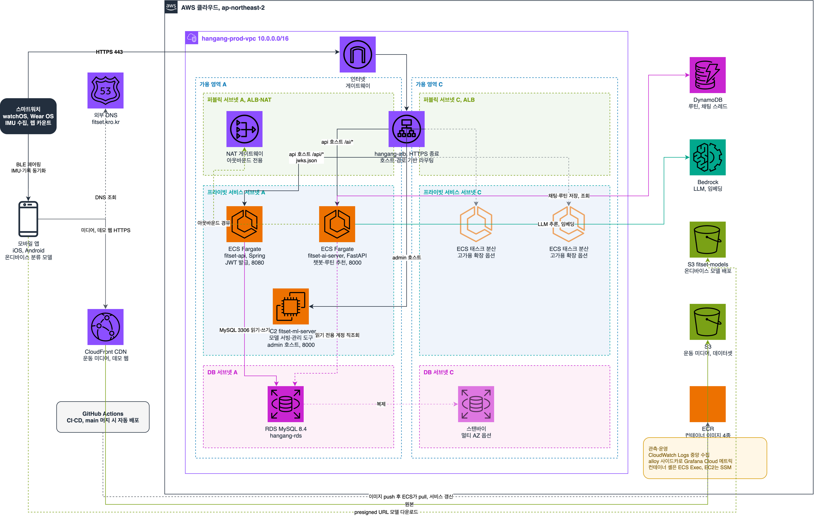
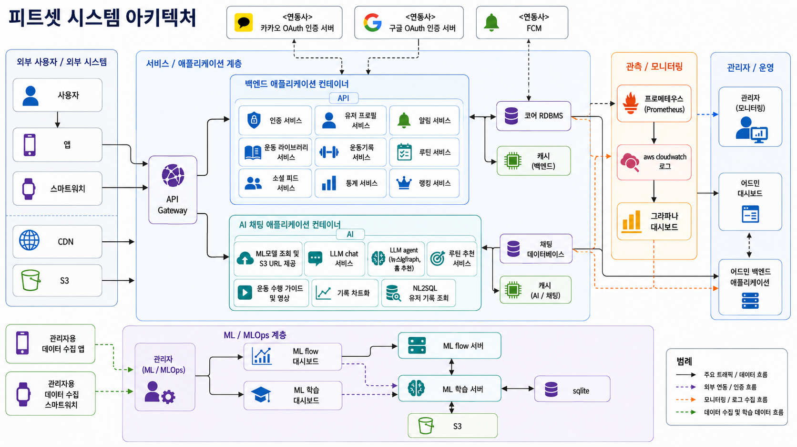
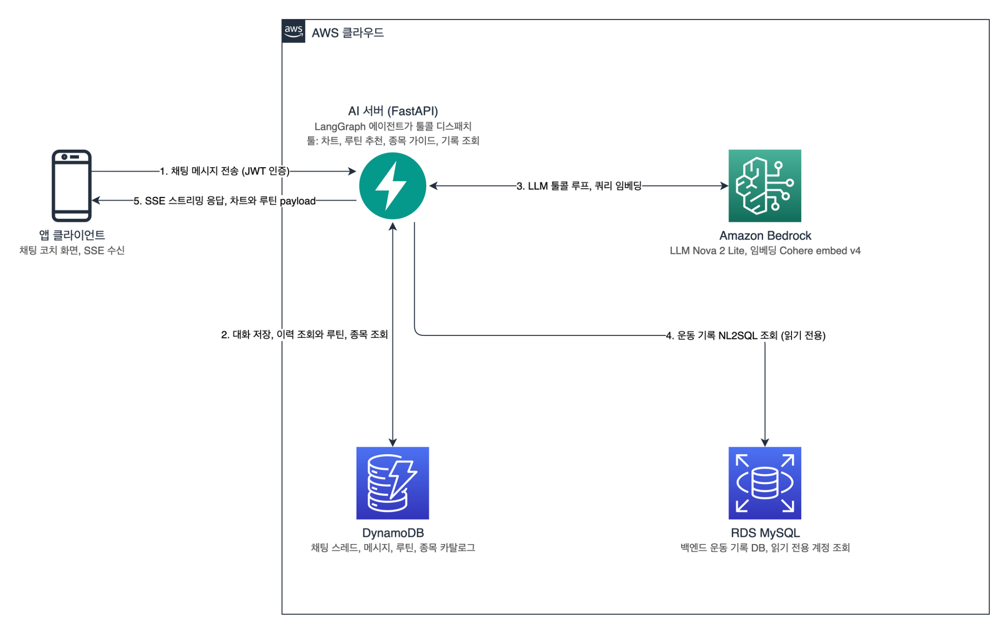
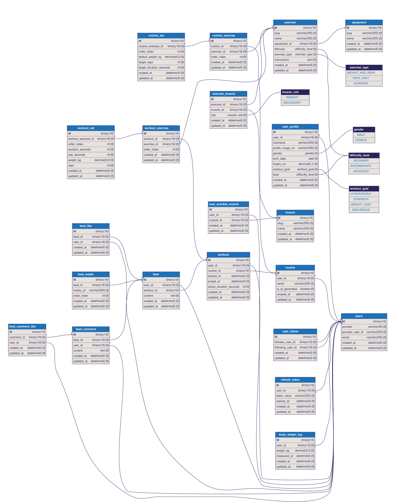
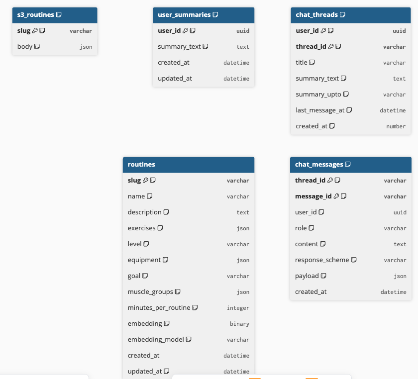

# FitSet AI Server

자동 수집된 운동 기록 데이터 위에서 LangGraph 에이전트 기반 챗봇 코칭과 루틴 추천을 SSE 스트리밍으로 제공하는 AI 서버입니다.

## 클라우드 아키텍처

## 시스템 아키텍처

## 기술 스택

| 구분 | 기술 |
|------|------|
| 서버 | Python, FastAPI |
| ML | PyTorch, MLflow, Core ML, ONNX |
| LLM | AWS Bedrock, LangGraph |
| DB | MySQL(RDS), DynamoDB(NoSQL) |
| 인프라 | ECS(Fargate), EC2, ALB, Route 53, VPC, NAT Gateway, S3, CloudFront, CloudWatch, SSM |
| 배포 | Docker, ECR, GitHub Actions |

## AI 에이전트 채팅 처리 플로우

## 백엔드 ERD, MySQL

[dbdiagram 보기](https://dbdiagram.io/d/6a44ddf036d348d120425f1f)

## 챗봇 문서 구조, DynamoDB

[dbdiagram 보기](https://dbdiagram.io/d/6a61a5d1067336e1ded8131a)

## 코드 아키텍처

| 경로 | 역할 |
|------|------|
| app/main.py | 앱 조립, 미들웨어, 라우터 등록 |
| app/deps.py | JWT 검증, 의존성 주입 |
| app/core/ | 설정, 인증, DynamoDB, ORM, LLM 클라이언트, 로깅 |
| app/clients/ | MySQL 읽기 전용 실행기 |
| app/chat/ | 채팅 스레드, 메시지, SSE, 요약 |
| app/users/ | 프로필, 기피 부위, 체중 이력 조회 |
| app/workouts/ | 운동 기록 조회 |
| app/routines/ | 루틴 추천, 룰 필터, 임베딩 랭킹 |
| app/exercises/ | 종목 카탈로그, 가이드 영상 |
| app/charts/ | 기록 집계, 차트 데이터 |
| app/agent/ | LangGraph 에이전트, 가드레일, 프롬프트, 툴 |
| scripts/ | 데이터 변환, 적재 배치 |
| data/ | 종목 메타데이터 |
| alloy/ | 메트릭 수집 사이드카 |
| docs/ | 아키텍처, API 명세 |
| tests/ | 단위, 통합 테스트 |

| 층 | 역할 |
|------|------|
| router | HTTP 라우팅, 형식 검증, 응답 직렬화 |
| service | 유스케이스 조율 |
| domain | 순수 업무 규칙, 엔티티 |
| repository | DynamoDB, MySQL 접근 |
| core | 공유 인프라 |

## 깃 컨벤션

| 항목 | 규칙 | 예시 |
|------|------|------|
| 커밋 메시지 | 타입(스코프): 요약 | fix(routines): C 계층 초기값 현실화 |
| 커밋 타입 | feat, fix, docs, test, refactor, ci, chore | |
| 브랜치 | 타입/케밥 케이스 | feat/thread-quota-409 |
| 이슈 연결 | 제목 끝 (#이슈번호) | test(charts): metric 9종 통합 (#36) |
| PR | 템플릿 작성, 요약, API 변경, 결정과 근거, 테스트 | |
| 머지 | main 머지 시 CD 자동 배포 | |
