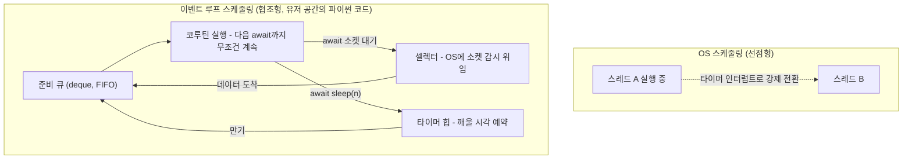
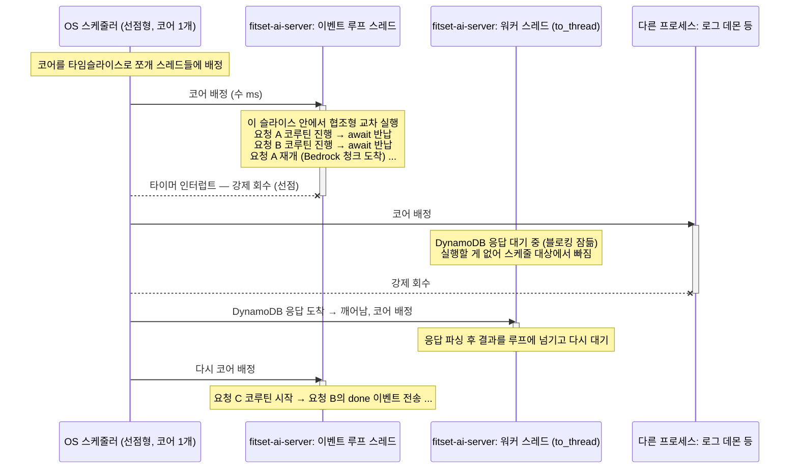

# 프로세스의 개수는 코어 개수와 비례한다

HTTP 요청이 코루틴으로 처리되는 경로부터 GIL과 프로세스 격리까지 따라가면, AI 서버가 왜 태스크당 1프로세스로 수평 확장하는지가 하나의 논리로 이어진다.

## 1. HTTP 요청이 오는 경로


ALB는 서버 간 라우팅, uvicorn은 프로토콜 번역, FastAPI 라우터는 함수 간 라우팅을 맡는다 — 스타트라인의 경로를 ALB는 어느 서버로 보낼지에, 라우터는 어느 함수로 보낼지에 쓴다.

## 2. OS 스케줄링과 이벤트 루프 스케줄링



OS는 인터럽트로 실행을 강제로 뺏지만, 이벤트 루프는 코루틴이 await에서 스스로 반납할 때만 다음 것을 실행한다 — 그래서 await 없는 긴 계산 하나가 모든 요청을 멈추고, 타이머 만기도 끼어들기가 아니라 준비 큐에 줄을 설 뿐이다.

같은 내용을 이 서버의 실제 스레드 구성으로 본 유즈케이스 — OS가 코어 하나를 우리 앱의 스레드들과 다른 프로세스 사이에서 선점형으로 돌리고, 루프 스레드가 코어를 받은 슬라이스 안에서는 요청 코루틴들이 협조형으로 교차 실행된다. 워커 스레드는 블로킹 대기 중엔 스케줄 대상에서 빠져 코어를 낭비하지 않는다.



깨우는 방식은 대기의 종류에 따라 다르다. sleep은 시각을 아는 예약이라 타이머 힙에 들어가고, 응답 대기는 시각을 모르므로 예측하지 않고 OS 셀렉터에 위임한다 — 데이터가 오기 전에는 그 태스크는 어디에도 등록되지 않은 채 CPU를 쓰지 않는다.

## 3. 이벤트 루프와 ContextVar (코드)

둘은 같은 레벨에 있다 — 루프가 준비 큐에서 코루틴을 꺼내 실행하는 바로 그 지점에서 그 태스크의 Context가 활성화된다(asyncio의 Task가 Context를 복사해 들고, Handle._run이 context.run으로 실행하는 것과 동일). 실행 가능한 통합 미니 루프:

```python
import contextvars, heapq, time
from collections import deque

trace_id_var = contextvars.ContextVar("trace_id")   # 전역 이름표 (값은 각 태스크의 Context에)


class Sleep:
    """await Sleep(n) — 루프에 "n초 뒤 깨워줘"를 전달하며 제어권을 반납한다."""
    def __init__(self, delay):
        self.delay = delay
    def __await__(self):
        yield self.delay          # await에서 멈춤 — 프레임이 여기서 동결된다


class MiniLoop:
    def __init__(self):
        self.ready = deque()      # 준비 큐 — (코루틴, 그 태스크의 Context)
        self.timers = []          # 타이머 힙 — (깨울 시각, 코루틴, Context)

    def create_task(self, coro):
        # asyncio.Task와 동일 — 태스크가 생길 때 자기 Context를 복사해 들고 다닌다
        self.ready.append((coro, contextvars.copy_context()))

    def run(self):
        while self.ready or self.timers:
            if not self.ready:
                due, _, coro, ctx = heapq.heappop(self.timers)
                time.sleep(max(0.0, due - time.monotonic()))  # 실전은 selector.select
                self.ready.append((coro, ctx))
            coro, ctx = self.ready.popleft()
            try:
                # asyncio의 Handle._run과 동일 — 그 태스크의 Context를 활성화한 채 진행
                delay = ctx.run(coro.send, None)
            except StopIteration:
                continue                                      # 코루틴 종료
            heapq.heappush(self.timers, (time.monotonic() + delay, id(coro), coro, ctx))


def deep_log(message):
    """콜스택 깊은 곳 — traceId를 파라미터로 안 받았지만 활성 Context에서 찾는다."""
    print(f"[trace={trace_id_var.get()}] {message}")


async def request(trace_id, step_seconds):
    trace_id_var.set(trace_id)          # 미들웨어 역할 — 자기 태스크의 Context에만 기록된다
    for step in range(1, 3):
        deep_log(f"단계 {step} 실행")
        await Sleep(step_seconds)       # Bedrock 응답 대기라고 생각하면 된다
    deep_log("완료")


loop = MiniLoop()
loop.create_task(request("aaa1", 0.3))
loop.create_task(request("bbb2", 0.5))
loop.run()
```

실행 결과 — 스레드 하나에서 두 요청이 교차 실행되는데, deep_log는 traceId를 인자로 받은 적 없이도 매번 자기 요청의 값을 찾는다.

```
[trace=aaa1] 단계 1 실행
[trace=bbb2] 단계 1 실행
[trace=aaa1] 단계 2 실행
[trace=bbb2] 단계 2 실행
[trace=aaa1] 완료
[trace=bbb2] 완료
```

핵심은 두 줄이다. create_task의 copy_context가 태스크마다 딕셔너리(변수 → 값)를 한 벌씩 쥐여주고, ctx.run(coro.send, None)이 실행 순간 그 딕셔너리를 활성화한다 — 함수의 어디까지 실행했는지는 코루틴 프레임이 await 지점에서 동결된 채 스스로 기억하고, coro.send가 그 지점부터 재개시킨다.

## 4. 자바와 파이썬의 CPU 병렬 수단

| | 자바 (스프링 백엔드) | 파이썬 (AI 서버) |
| --- | --- | --- |
| CPU 병렬 수단 | 스레드 — 코어 4개면 스레드 풀이 다 쓴다 | 스레드로는 불가(GIL), 프로세스를 늘려야 한다 |
| 병렬 단위 간 메모리 | 스레드는 힙 공유, 캐시 1벌 | 프로세스는 격리, 캐시 N벌 |
| 자연스러운 확장 | 프로세스 1개 키우기 (수직) | 프로세스와 태스크 늘리기 (수평) |

GIL은 한 프로세스에서 한 번에 한 스레드만 파이썬 코드를 실행하게 하는 자물쇠다. 존재 이유 중 하나가 참조 카운팅 보호인데, 모든 파이썬 객체 머리에 붙은 refcount는 여러 실행 흐름이 동시에 증감하면 망가지고, 읽기만 해도 증감(쓰기)이 일어난다.

GIL의 보호 범위는 프로세스 하나 안이다. 프로세스 둘이 공유 메모리의 같은 파이썬 객체를 만지면 지켜줄 공용 자물쇠가 없어 refcount가 꼬이고, 객체 내부 포인터도 자기 주소 공간에서만 유효하다. 그래서 공유 메모리에 넣을 수 있는 것은 날바이트(numpy 버퍼 등)뿐이고, 피클은 공유가 아니라 직렬화해 복사본을 나르는 수단이라 메모리 N벌 문제의 답이 아니다.

프로세스 격리 자체는 파이썬이 아니라 OS의 보편 규칙이다. 언어가 결정하는 것은 두 가지 — 프로세스를 여러 개 띄울 수밖에 없는가(파이썬, Node.js는 그렇다, 자바는 아니다), 띄웠을 때 공유 메모리로 우회할 수 있는가(C 계열의 nginx, PostgreSQL은 설계로 가능, 파이썬 객체는 불가).

## 5. 결론

1. 파이썬은 이벤트 루프 덕에 스레드 하나로 I/O 동시성을 자체 처리한다 — 요청 수백 개가 한 루프에서 교차 실행되므로 동시성을 위해 프로세스를 늘릴 필요가 없다.
2. CPU 병렬만이 프로세스를 늘릴 이유인데, 코어 1개에 프로세스 여러 개는 병렬로 돌 자리가 없다 — 그래서 프로세스는 코어당 1개가 기준이다.
3. 프로세스를 늘리면 격리 때문에 인메모리 루틴 스토어 약 350MB가 프로세스 수만큼 복제된다 — 코어 2개 태스크로 수직 확장하면 워커 2개에 700MB를 내야 한다.
4. 따라서 AI 서버는 태스크당 1vCPU 1워커로 두고 태스크 수를 늘리는 수평 확장이 알맞다 — 상태는 DynamoDB에, 인증은 무상태 JWT라 코드 변경 없이 늘어난다.

수평 확장의 알려진 부작용은 두 가지다. 인스턴스 로컬 레이트리밋이 태스크 수만큼 느슨해지는 것, 인메모리 루틴 스토어가 태스크마다 부팅 시점 스냅샷인 것(감사 F16). 그리고 실측상 병목은 CPU가 아니라 Bedrock 쿼터라, 태스크를 늘려도 그 벽은 그대로다.
